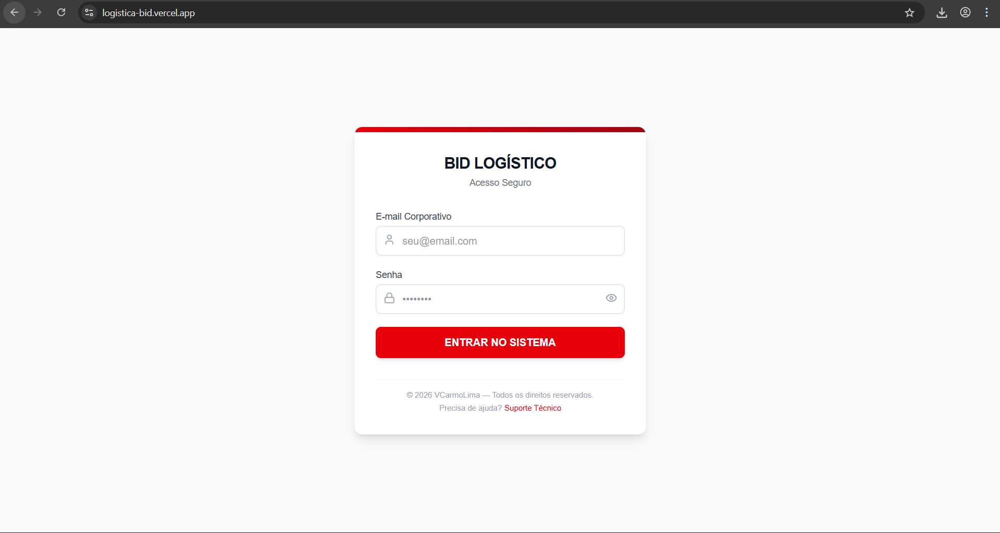
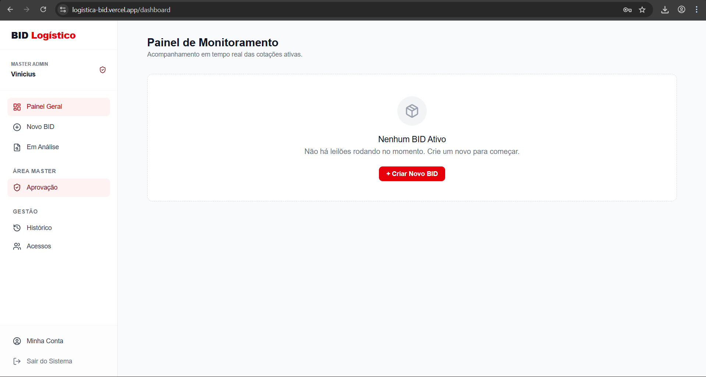

# Sistema de BID Logístico (SaaS Enterprise)


> **Plataforma Enterprise de Leilão Reverso para Logística.** > Centralize cotações, garanta compliance na escolha de transportadoras e audite todo o processo em tempo real.

---

## Screenshots

### Acesso Seguro & Identidade
_Login unificado para Administradores e Transportadoras com autenticação via Supabase Auth._


### Painel Admin
_Painel amigável com funções de criação, análise, homologação e histórico de auditoria._


---

## Sobre o Projeto

O **Sistem de BID Logístico** moderniza o processo de contratação de fretes (Spot e Dedicados), substituindo e-mails e WhatsApp por um ambiente de **Leilão Reverso** seguro e transparente.

### Principais Diferenciais:
* **Realtime Bidding:** O mural atualiza instantaneamente quando um concorrente dá um lance, sem precisar recarregar a página (Supabase Realtime).
* **Segurança de Dados (RLS):** Implementação de *Row Level Security* no banco de dados. Uma transportadora nunca vê os dados da outra, e hackers não conseguem alterar dados sensíveis.
* **Score Inteligente:** Algoritmo de decisão que pondera **Preço (70%)** e **Prazo (30%)** para sugerir o melhor custo-benefício.
* **Auditoria Automática:** Geração de PDF oficial ("Compliance Report") ao final de cada processo, contendo a timeline completa e o "Livro de Ofertas".
* **Gamificação:** Feedback visual imediato ("Você é o Líder" vs "Oferta Superada") e alertas de competitividade para lances ruins.

---

## Stack Tecnológica

O projeto foi migrado de uma arquitetura legada (Python) para uma stack moderna e escalável:

* **Frontend:** [Next.js 14](https://nextjs.org/) (App Router, Server Components).
* **Estilização:** [Tailwind CSS](https://tailwindcss.com/) + [Lucide Icons](https://lucide.dev/).
* **Backend & Database:** [Supabase](https://supabase.com/) (PostgreSQL).
* **Autenticação:** Supabase Auth (Email/Password).
* **Infraestrutura:** Vercel (Frontend) + Supabase Cloud (Backend).
* **PDF Generation:** `jspdf` + `jspdf-autotable` (Client-side generation).

---
## Estrutura do Repositório

```text
/
├── database/               # Documentação do Banco de Dados (Schemas SQL & RLS)
├── public/                 # Arquivos Estáticos (Acessíveis publicamente)
│   └── screenshots/        # Imagens da documentação
│
├── src/                    # Código Fonte da Aplicação
│   ├── app/                # Next.js App Router (Páginas e Rotas)
│   │   ├── dashboard/      # Painel Logado (Admin & Transportadora)
│   │   └── page.tsx        # Página de Login
│   │
│   ├── components/         # Componentes React Reutilizáveis
│   │   └── ...             # Componentes de Negócio (BidCard, Tabelas)
│   │
│   ├── lib/                # Configurações do Core
│   │   ├── supabase.ts     # Cliente de Conexão com Banco
│   │   ├── utils.ts        # Funções Auxiliares
│   │   └── audit.ts        # Funções de PDF Auditoria
│   │
│   └── types/              # Definições de Tipos TypeScript
│
├── .env.local              # Variáveis de Ambiente (Segredos - Não comitado)
├── .gitignore              # Arquivos que não devem ser comitados
├── eslint.config.mjs       # Configuração do ESLint
├── next.config.ts          # Configuração do Next.js
├── package.json            # Dependências do Projeto
├── package-lock.json       # Lock de dependências
├── postcss.config.js       # Configuração do PostCSS
├── tsconfig.json           # Configuração do TypeScript
├── README.md               # Documentação Oficial
└── ROADMAP.md              # Roadmap do Projeto

---

## Instalação e Configuração

### Pré-requisitos
* Node.js 18+ instalado.
* Conta no Supabase (Projeto criado).

### 1. Clone o repositório
```bash
git clone [https://github.com/VCarmoLima/logistica-bid.git](https://github.com/VCarmoLima/logistica-bid.git)
cd logistica-bid
```
### 2. Instale as dependências
```bash
npm install
```
### 3. Configure as variáveis de ambiente
Crie um arquivo .env.local na raiz do projeto e adicione suas chaves do Supabase:
```bash
NEXT_PUBLIC_SUPABASE_URL="sua_url_do_supabase"
NEXT_PUBLIC_SUPABASE_KEY="sua_chave_anon_publica"
EMAIL_USER="seu_email_para_envio@gmail.com"
EMAIL_PASS="sua_senha_de_app_gmail"
```
### 4. Execute o projeto
```bash
npm run dev
```
### 5. Acesse o aplicativo
Abra o navegador e acesse [`http://localhost:3000`](http://localhost:3000).

---

## Estrutura de Permissões (RBAC)
O sistema possui 3 níveis de acesso distintos, protegidos via Banco de Dados (Policies):

1. Master Admin: Acesso total. Pode aprovar BIDs finais, gerenciar usuários (Admins/Transportadoras) e ver logs de auditoria.

2. Analista (Standard): Pode criar BIDs, acompanhar o leilão e selecionar vencedores (mas não aprovar finalização).

3. Transportadora: Acesso restrito apenas ao "Mural de Oportunidades" e seu próprio "Histórico". Não vê dados de concorrentes.

---

## Melhorias
Para visualizar as funcionalidades planejadas e o progresso do desenvolvimento, consulte o arquivo [ROADMAP.md](https://github.com/VCarmoLima/logistica-bid/blob/main/ROADMAP.md).

---

## Segurança e Privacidade
Este repositório contém uma versão demonstrativa. Logos e dados reais de empresas foram removidos ou ofuscados para proteção de propriedade intelectual e dados sensíveis.

---

## Licença

Este projeto está licenciado sob a licença MIT. Consulte o arquivo LICENSE para mais detalhes.

Direitos reservados a [VCarmoLima](https://www.linkedin.com/in/viniciusdocarmolima/).