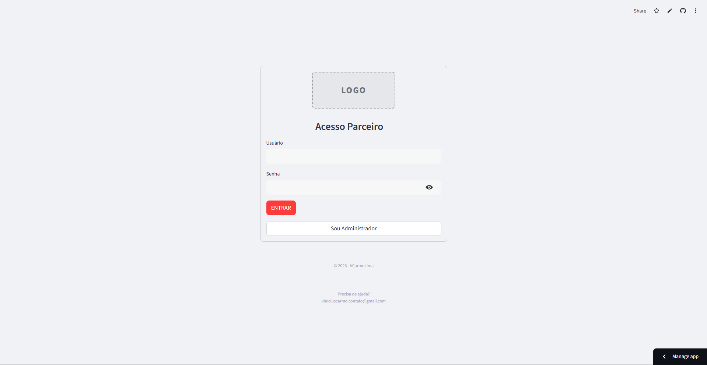
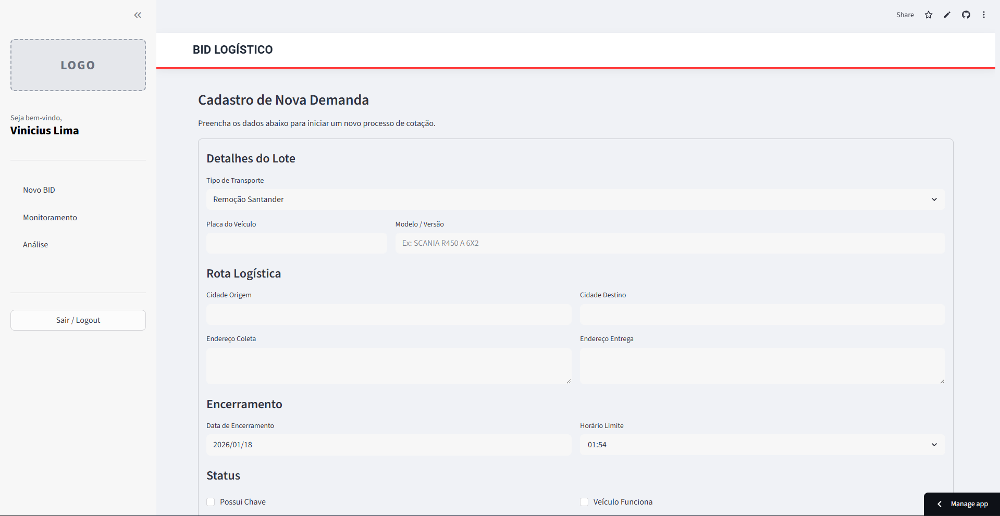

# Sistema de Gestão de BIDs Logísticos (SaaS)

Plataforma web "full-stack" desenvolvida em Python para digitalização e automação de processos de cotação de fretes (BIDs). O sistema substitui negociações manuais descentralizadas por um ambiente de leilão reverso unificado, transparente e auditável, conectando embarcadores e transportadoras em tempo real.

---
### 

---
### 

---
## Visão Geral do Projeto

Este projeto foi concebido para resolver a ineficiência no processo de contratação de fretes spot e dedicados. A solução centraliza as ofertas, valida as regras de negócio automaticamente e fornece ferramentas de auditoria para compliance.

### Principais Diferenciais Técnicos
* **Processamento Concorrente:** Utilização de Threading para execução de workers em background, permitindo monitoramento de prazos sem bloquear a interface do usuário.
* **Regras de Negócio Complexas:** Algoritmo de validação de lances que impede propostas desvantajosas (preço maior com prazo igual ou pior) em tempo real.
* **Geração Dinâmica de Documentos:** Criação automatizada de relatórios de auditoria em PDF utilizando a biblioteca FPDF, garantindo rastreabilidade do processo.
* **Arquitetura SaaS:** Estrutura pronta para nuvem, com segregação de dados e gestão de múltiplos usuários.

## Funcionalidades

### Painel Administrativo (Gestão)
* **Cadastro de Cargas:** Interface para input detalhado de rotas, especificações de veículos e upload de imagens (integrado ao Supabase Storage).
* **Dashboard em Tempo Real:** Monitoramento ao vivo das cotações com atualização automática de status e rankings.
* **Matriz de Decisão:** Classificação automática de propostas baseada em Preço, Prazo e Score ponderado (Custo-Benefício).
* **Homologação e Encerramento:** Fluxo de aprovação formal com geração automática de PDF contendo o histórico completo dos lances e dados do vencedor.

### Portal do Transportador
* **Marketplace de Oportunidades:** Visualização de cargas disponíveis com detalhes técnicos e fotos.
* **Feedback Inteligente:** O sistema informa visualmente o "Preço a Bater" e o "Prazo do Líder", orientando a competitividade.
* **Validação de Input:** Bloqueio preventivo de lances que não atendem aos critérios mínimos de melhoria (Preço vs. Prazo).

### Automação (Backend Worker)
* **Monitoramento de Prazos:** Serviço em background que verifica o vencimento dos leilões a cada 10 segundos.
* **Alteração de Status:** Transição automática de status de "Aberto" para "Em Análise" sem intervenção humana.

## Stack Tecnológico

* **Linguagem:** Python 3.9+
* **Framework Web:** Streamlit (focado em Data Apps e Dashboards Interativos)
* **Banco de Dados:** Supabase (PostgreSQL)
* **Storage:** Supabase Storage (Gerenciamento de Imagens)
* **Bibliotecas-chave:** Pandas (Manipulação de Dados), FPDF (Relatórios), Threading (Concorrência).

## Estrutura do Repositório

```text
/
├── database/           # Scripts SQL para criação do banco de dados (Schema)
├── src/                # Código fonte da aplicação
│   ├── app.py          # Arquivo principal (Frontend + Worker Thread)
│   ├── utils_pdf.py    # Módulo de geração de relatórios PDF
│   └── sync_users.py   # Script utilitário para gestão de usuários
├── image/              # Assets e imagens do projeto
├── ROADMAP.md          # Planejamento de funcionalidades futuras
├── requirements.txt    # Dependências do projeto
├── README.md           # Documentação
└── credentials.json    # Arquivo modelo de credenciais 
```

---

### 1. Pré-requisitos
 - Python instalado.
 - Conta configurada no Supabase (URL e Key).

### 2. Instalação
Clone o repositório e instale as dependências:
```bash
git clone [https://github.com/VCarmoLima/logistica-bid.git](https://github.com/VCarmoLima/logistica-bid.git)
cd logistica-bid
pip install -r requirements.txt
```
### 3. Configuração das Variáveis de Ambiente
Crie um arquivo .env na raiz do projeto com as chaves do Supabase:
```bash
SUPABASE_URL="sua_url_supabase"
SUPABASE_KEY="sua_chave_anonima"
```

### 4. Configuração do Banco de Dados
   Execute o script SQL localizado em database/schema.sql no seu painel do Supabase para criar as tabelas necessárias.

### 5. Execução
```bash
streamlit run src/app.py
```
O sistema estará acessível em [http://localhost:8501](http://localhost:8501).

---

## Melhorias
Para visualizar as funcionalidades planejadas e o progresso do desenvolvimento, consulte o arquivo [ROADMAP.md](https://github.com/VCarmoLima/logistica-bid/blob/main/ROADMAP.md).

---
## Segurança e Privacidade
Este repositório contém uma versão demonstrativa. Logos e dados reais de empresas foram removidos ou ofuscados para proteção de propriedade intelectual e dados sensíveis.

---
Este projeto está licenciado sob a licença MIT. Consulte o arquivo LICENSE para mais detalhes.

Desenvolvido por [VCarmoLima](https://www.linkedin.com/in/viniciusdocarmolima/). 